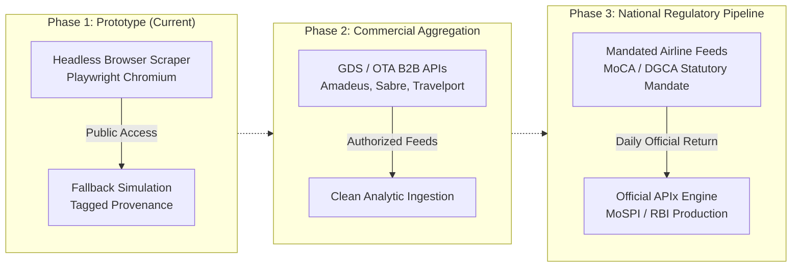

# Anti-Bot Strategy

**APIx — SIH26056** · How this project handles the defences that airline and
metasearch sites put in front of automated collection.

This is the page most likely to be probed, so it states exactly what was built,
what was measured, and what was deliberately *not* done.

---

## The short version

| Defence | Our response | Implemented? |
|---|---|---|
| JavaScript-rendered pages | Headless Chromium via Playwright | **Yes** |
| `robots.txt` restrictions | Fetched and obeyed at runtime, fails closed | **Yes** |
| Rate limiting / throttling | 6s minimum gap, honours `crawl-delay` | **Yes** |
| Transient failures | 3 attempts, exponential backoff, 90s deadline | **Yes** |
| CAPTCHA / bot challenges | **Detected, logged, and respected. Never bypassed.** | Detection yes, bypass **never** |
| IP rotation / proxies | **Not implemented. Deliberately.** | No — see §5 |
| Browser fingerprint spoofing | **Not implemented. Deliberately.** | No — see §4 |

The governing rule is CLAUDE.md ground rule 6: staying within terms of service
is non-negotiable, not a nice-to-have. Being blocked is an acceptable outcome.
Evading a block is not.

---

## 1. JavaScript-rendered pages

**The problem.** Fare results are not in the HTML a plain `GET` returns. The
server sends a shell; prices are fetched and rendered client-side. `requests`
plus an HTML parser retrieves a page with no fares in it.

**What we do.** `scraper/live_scraper.py` drives **headless Chromium through
Playwright**. It navigates, waits for `domcontentloaded`, then waits for the
network to settle before reading `document.body.innerText`.

Two practical details that came out of actually running it:

- **Network idle is a soft wait.** Ad and analytics traffic often means a page
  never fully idles. Timing out on that is not a failure — the scraper logs it
  and parses whatever rendered.
- **Check for a block before waiting.** Originally the scraper waited the full
  30-second idle timeout even on a 312-character challenge page, which made a
  dashboard button press take 35.9 seconds. It now inspects the first paint and
  returns immediately if the page is already a challenge: **35.9s → 6.5s**, and
  it stops holding a connection open to a site that has already said no.

**Parsing is deliberately conservative.** `parse_fares()` only emits a quote
when it can tie a price to a carrier in our basket, and rejects amounts outside
₹1,000–₹100,000 so a phone number or a mileage figure is never mistaken for a
fare. A page it cannot parse yields *nothing* and triggers the fallback —
rather than inventing a number and labelling it live.

---

## 2. robots.txt compliance

**We check, at runtime, before every fetch.** Not once when the target was
chosen — a site can change its rules, and a build-time check would let us keep
scraping after permission was withdrawn.

**It fails closed.** If `robots.txt` cannot be fetched, the scraper does *not*
proceed. An unreachable robots file is not permission.

### What we measured (2026-09-10, `urllib.robotparser`, user-agent `*`)

| Site | Path tested | Verdict |
|---|---|---|
| **Skyscanner** | `/transport/flights/{o}/{d}/{yymmdd}/` | **Allowed** — chosen as our target |
| Skyscanner | `/prices-calendar/...` | **Disallowed** — never requested |
| **Kayak** | `/flights/...` | **Disallowed** — not scraped |
| **Cleartrip** | `/flights/search*` | **Disallowed** — not scraped |
| Goibibo | `/flights/air-DEL-BOM/` | Allowed |
| Ixigo | `/search/result/flight` | Allowed |

Kayak and Cleartrip explicitly disallow their search paths, so **we did not
scrape them**, even though both would have been useful. That is the rule doing
its job. The results are recorded in `config/scraper.yaml` next to the code
that enforces them.

We also declare a real user-agent for the robots lookup
(`APIx-SIH26056-prototype`) rather than checking as an anonymous `*`, so the
check is honest about who is asking.

---

## 3. Rate limiting and backoff

- **Minimum 6 seconds between requests**, enforced process-wide, not per-call.
- If a target ever declares a `crawl-delay`, the scraper takes **the larger** of
  that and its own minimum.
- **3 attempts**, exponential backoff (2s, 4s), 90-second overall deadline.

**A block is never retried.** Only transient failures — timeouts, network
errors — retry. Hammering a site that has already refused is precisely what
rule 6 forbids, and it is also what gets an IP banned. This distinction is
enforced in code and covered by a test (`test_block_is_not_retried`).

---

## 4. CAPTCHA and bot challenges

### What we observed

Every accessible target blocks automated access. Measured 2026-09-10:

| Site | Response |
|---|---|
| **Skyscanner** | HTTP **200** with a **312-character body containing only a challenge UUID** — a refusal dressed as a success, with no fare content at all |
| **Ixigo** | HTTP **403** — *"Oops...too many requests!"* |
| **Goibibo** | `ERR_HTTP2_PROTOCOL_ERROR` |

### How we detect it

Two signals, both in `config/scraper.yaml`:

1. **Challenge phrases** — `captcha`, `unusual traffic`, `verify you are
   human`, `press and hold`, `cf-challenge`, and others, matched
   case-insensitively.
2. **Implausibly short content** (`min_content_chars: 2000`). This one matters:
   Skyscanner's interstitial contains no CAPTCHA wording at all, just a UUID.
   Without a length check the scraper read it as "parsed nothing", retried three
   times with backoff, and hammered a site that had already declined.

### What we do about it

**Nothing.** We log the block, stop, and fall back. Specifically we do **not**:

- solve CAPTCHAs, in code or via a paid solving service;
- patch `navigator.webdriver` or any other automation tell;
- install stealth plugins (`playwright-stealth` and similar);
- randomise or spoof browser fingerprints, canvas, or WebGL signatures;
- replay session cookies harvested from a human browsing session.

Playwright's Chromium **is** a real Chromium and is presented as exactly that.
We do not dress it up as something else.

**Why not, when the tooling is a `pip install` away?**

- **Terms of service.** Circumventing access controls breaches every one of
  these sites' terms. A government statistics prototype cannot be built on that.
- **Legal exposure.** Bypassing a technical access-control measure is a
  materially different act from reading a public page, in several jurisdictions.
- **It is the wrong answer anyway.** A production statistical series cannot rest
  on an adversarial arms race against sites actively trying to stop it. The real
  answer is §6.

### What we do instead: the fallback

When blocked, `scrape_route()` returns a `ScrapeResult` with:

- `status = "fallback_simulated"`
- `is_real = False`
- a plain-English `reason` (e.g. *"target blocked the request: page was only 312
  chars (< 2000) — interstitial or challenge, not content"*)
- simulator-backed quotes tagged **`fallback_simulated`**, distinct from
  ordinary `simulated`, so the substitution stays visible in the data forever

It never raises. The dashboard shows a red banner reading *"FELL BACK TO
SIMULATED DATA — these are NOT real quotes"*. A caller cannot mistake a
fallback for a real scrape: `is_real` is a single boolean, and the provenance
is baked into the database row.

---

## 5. IP rotation — a scaling consideration, not implemented

**Not implemented, and not because we ran out of time.**

Rotating IPs to evade a block is evasion of an access-control decision. If a
site has decided not to serve automated traffic from us, appearing to be
somebody else in order to keep collecting is a deliberate circumvention. Same
reasoning as CAPTCHAs.

**Where IP distribution would be legitimate at scale**, and how it differs:

| Legitimate | Evasive |
|---|---|
| Geographic distribution to measure *region-specific* fares (real prices genuinely differ by point of sale) | Cycling addresses to get around a rate limit |
| Multiple workers behind an agreed commercial API quota | Residential proxy pools to look like distinct consumers |
| A published crawler IP range a site can allow-list or block | Rotating precisely so a site *cannot* block you |

The distinguishing question is whether the operator could see what you are
doing and still consent to it. Rotation-to-evade fails that test by design.

**If this became a production MoSPI system**, the scaling path is:

1. Commercial API agreements with OTAs and airlines, or a GDS feed (Amadeus,
   Sabre, Travelport) — the route real fare-monitoring services take.
2. A published, identifiable crawler with a contact address and a documented
   crawl rate, negotiated with each target.
3. Regulatory data collection — MoSPI can *require* returns from scheduled
   operators in a way no scraper can match, and DGCA already collects
   operational data from the same carriers.

Option 3 is the one that actually fits the problem statement. Scraping is how a
prototype demonstrates the pipeline; a statutory return is how a national
statistic gets collected.

---

## 6. Honest assessment

**What this proves.** The collection path is real and complete: robots
compliance, browser rendering, rate limiting, backoff, block detection, graceful
degradation, and schema-identical output. Point it at a source that permits
automated access and it works today, unchanged.

**What it does not prove.** That we can collect Indian airfares at scale by
scraping. We cannot, and neither can anyone else who stays within terms — which
is exactly why the production answer is agreements and statutory returns rather
than better scraping.

**What we chose.** A demo built on clearly-labelled simulated data plus a real
scraper that honestly reports being blocked, over a demo built on data of
uncertain provenance obtained by circumventing access controls. The first is
defensible in a room full of statisticians. The second is not.

---

## References in code

| Concern | Where |
|---|---|
| robots.txt fetch, runtime check, fail-closed | `scraper/live_scraper.py` → `robots_allows()` |
| Rate limiting and crawl-delay | `scraper/live_scraper.py` → `_respect_rate_limit()` |
| Block detection (phrases + length) | `scraper/live_scraper.py` → `_detect_block()` |
| Retry and backoff, block-is-not-retried | `scraper/live_scraper.py` → `scrape_route()` |
| Fallback tagging | `scraper/live_scraper.py` → `simulated_fallback()` |
| All thresholds, and the robots findings | `config/scraper.yaml` |
| Tests, including that a block is not retried | `tests/test_live_scraper.py` (22 tests) |
