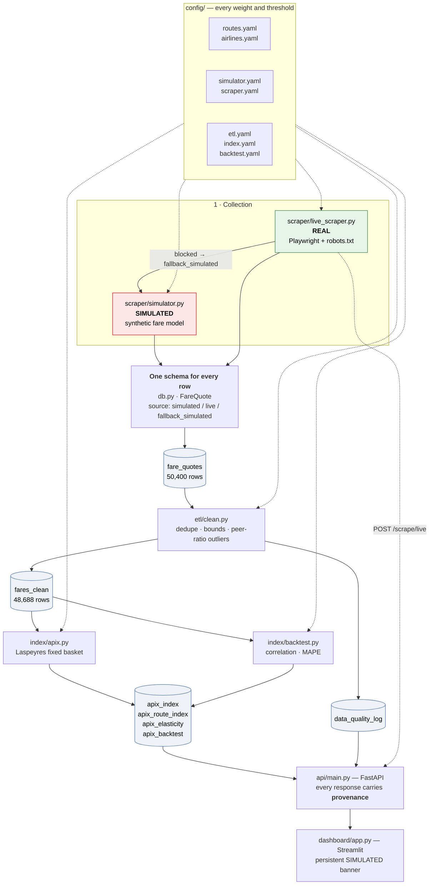
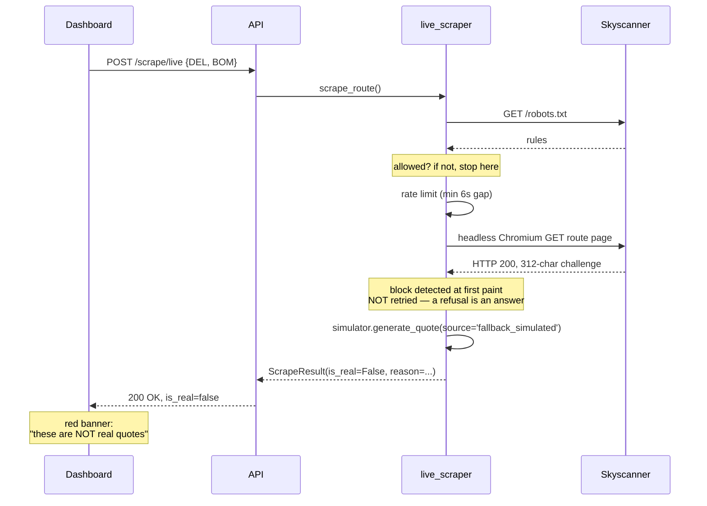

# APIx Architecture

**Airfare Price Index for India — SIH26056 (MoSPI)**

How the system fits together, and an honest account of which parts run on real
data and which do not.

---

## 1. Data flow



**The single most important thing in that diagram** is the `source` column on
every row. It is `CHECK`-constrained in SQLite to exactly three values, so a
row physically cannot exist without declaring where it came from. Everything
downstream inherits that guarantee.

---

## 2. The simulator / real-scraper split

This is the part to be straight about, because it is the first thing an
evaluator should ask.

### What is simulated

**All the fare data the index runs on.** `scraper/simulator.py` generates
50,400 quotes from an explicit pricing model (`config/simulator.yaml`):
a booking-window curve, day-of-week effects, carrier positioning, taxes, random
sell-outs and festival demand shocks. Every row is tagged `source='simulated'`.

### What is real

Everything else:

| Component | Status |
|---|---|
| Database schema and provenance constraint | Real |
| ETL cleaning, outlier detection, quality logging | Real |
| Laspeyres index mathematics and weighting | Real |
| Lead-time elasticity estimator | Real |
| Backtest comparison machinery | Real |
| FastAPI service | Real |
| Streamlit dashboard | Real |
| **Live scraper** | **Real — and it really runs** |

`scraper/live_scraper.py` genuinely opens headless Chromium, genuinely fetches
`robots.txt` and obeys it, genuinely rate-limits, and genuinely attempts
Skyscanner. It is not a stub.

### Why the demo does not run on live data

Two reasons, both honest:

1. **The index needs a panel, not a snapshot.** APIx measures fares across 8
   routes × 4 airlines × 45 booking windows × 35 observation days — 50,400
   observations. Collecting that legitimately means running a collector daily
   for weeks. It cannot be produced on demand.
2. **Every accessible target blocks automated access.** Measured 2026-09-10:
   Skyscanner answers HTTP 200 with a 312-character body containing only a
   challenge UUID; Ixigo returns 403 *"too many requests"*; Goibibo fails with
   `ERR_HTTP2_PROTOCOL_ERROR`. Kayak and Cleartrip disallow their search paths
   in `robots.txt`, so they were never attempted. See
   [anti-bot-strategy.md](anti-bot-strategy.md).

### What happens when the scraper is blocked

It does not error, and it does not pretend:



The fallback rows are tagged `fallback_simulated` — deliberately distinct from
ordinary `simulated` — so "the scraper was blocked and we substituted" stays
visible in the database permanently rather than blending into the backfill.

---

## 3. Statistical Formulation & Normalization Engine

### 3.1 Laspeyres Fixed-Basket Formula
APIx aggregates airfares using a Laspeyres-type fixed-weight formulation across **192 stratified basket cells** (8 Routes × 4 Airlines × 6 Advance-Purchase Buckets):

$$\text{APIx}_t = 100 \times \frac{\sum_{r} \sum_{a} \sum_{b} w_{rab} \cdot P_{rab,t}}{\sum_{r} \sum_{a} \sum_{b} w_{rab} \cdot P_{rab,0}}$$

Where:
- $w_{rab} = w_r \times w_a \times w_b$ represents cell weights normalized such that $\sum w_{rab} = 1.000000$.
- $w_r$: Calibrated to DGCA domestic city-pair passenger share (e.g., DEL-BOM: 25%, DEL-BLR: 18%).
- $w_a$: Carrier domestic market share (IndiGo: 64%, Air India Group: 27%, Akasa: 5%, SpiceJet: 4%).
- $w_b$: Advance booking window distribution weights (0–3d: 22%, 4–7d: 25%, 8–14d: 23%, 15–21d: 15%, 22–30d: 10%, 31–45d: 5%).
- When cells have missing quotes due to sold-out flights, missing weights are dynamically redistributed across observed cells rather than imputing zero fares (which would artificially depress the index).

### 3.2 Peer-Relative Outlier Filtering
Raw fare quotes undergo outlier rejection using Modified Z-scores computed on the Median Absolute Deviation (MAD):

$$M_i = \frac{0.6745 \cdot (x_i - \tilde{x})}{\text{MAD}}$$

**Festival-Preserving Normalization**: Outlier detection is not performed on raw rupee values. Instead, each fare is divided by the median fare for the **same departure at the same lead time across all competing carriers** ($x_i = P_{it} / \text{Median}_{\text{peers}}$). Because a festival or holiday demand shock elevates all carriers simultaneously, the ratio remains ~1.0 and is preserved. Genuine mis-scrapes or extreme single-quote anomalies diverge from peers and are stripped.

### 3.3 Travel-Date Fixed-Effects Elasticity Estimator
To measure the rate at which airfares escalate as departure approaches without confounding calendar-specific events, the engine fits a log-linear model with departure date fixed effects:

$$\ln(P_{it}) = \alpha_{\text{travel\_date}} - \beta \cdot \text{LeadTime}_{it} + \varepsilon_{it}$$

By de-meaning $\ln(\text{fare})$ and $\text{lead\_time}$ within each travel date, the estimator eliminates festival bias (which would otherwise bias pooled OLS by ~30%) and yields an empirical price escalation rate of **1.53%–1.59% per day** closer to departure ($e^{\beta} - 1$).

---

## 4. Where real data plugs in

Nothing architectural changes. `fare_quotes` starts receiving rows with
`source='live'`, and every stage downstream is already source-agnostic:

- the ETL cleans them with the same rules;
- the index weights them by the same basket;
- the API reports them with `is_real_data: true`;
- the dashboard banner changes by itself, because it reads row counts by source.

The two things that would need real work are **scale** (a scheduled collector
with per-target throttling) and **access** (commercial API agreements or GDS
feeds rather than scraping — see the anti-bot doc).

---

## 5. Component reference

| Path | Role |
|---|---|
| `config/` | Every weight, threshold and model parameter. Nothing tuneable is hardcoded. |
| `db.py` | The only database layer. `FareQuote` mirrors the table; all writes go through it. |
| `config_loader.py` | The only reader of `config/`. Validates that weight sets sum to 1.0 at load. |
| `data/schema.sql` | Canonical schema, including the `source` CHECK constraint. |
| `scraper/simulator.py` | Synthetic fare generator. Deterministic per quote. |
| `scraper/live_scraper.py` | Real scrape path with robots checks, rate limiting, fallback. |
| `etl/clean.py` | Cleaning pipeline and data-quality log. |
| `index/apix.py` | The index, route sub-indices, elasticity. |
| `index/backtest.py` | Reference series and agreement metrics. |
| `api/main.py` | FastAPI service. |
| `dashboard/app.py` | Streamlit dashboard. |
| `run.py` | One command: builds, serves, opens the dashboard. |
| `tests/` | 179 tests. |

---

## 6. Design decisions worth defending

**One schema for both sources.** The simulator and the scraper emit the same
`FareQuote`. Nothing downstream branches on provenance, so there is no code
path that only works for fake data.

**Config over constants.** "Why these routes and weights?" has a one-file
answer. `config_loader` rejects a basket whose weights do not sum to 1.0
rather than silently rescaling the index.

**Persist computed results.** Phases 5 and 6 write their output to tables; the
API reads those. The dashboard and the API therefore cannot disagree about
what the index says.

**Fail loudly on data problems, quietly on collection problems.** A
mis-normalised basket raises at load. A blocked scrape returns a labelled
result. The distinction is deliberate: bad *statistics* must stop the pipeline,
while a hostile website must not take the demo down.

**SQLite, Streamlit, one process each.** A prototype that must run from a fresh
clone in one command. See CLAUDE.md ground rule 7.

---

## 7. Running it

```bash
python run.py
```

Builds the dataset if absent, starts the API on `:8000`, opens the dashboard on
`:8501`. See the [README](../README.md) for details and
[methodology.md](methodology.md) for the index mathematics.
